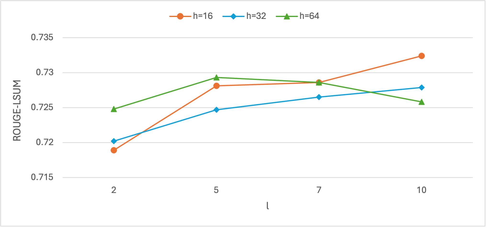

# Instance-Driven Prompt Generation for Improved Multi-hop Question Decomposition

This repository contains the code and supplementary materials for the research paper titled, "**Instance-Driven Prompt Generation for Improved Multi-hop Question Decomposition**." This study investigates reasoning in large language models (LLMs) by employing instance-driven decomposition of complex questions, matching the performance of fine-tuning approaches while requiring only 0.3% additional parameter training.

## Abstract

To enhance the reasoning ability of LLMs, decomposing complex questions into a series of manageable sub-steps has proven effective. Traditional methods rely on in-context few-shot learning, requiring manually designed exemplars, a process that can be time-consuming and lacks scalability. Alternatively, a question decomposer model can generate sub-questions to enable reasoning through a QA model iterating over each sub-question.

The **Instance-Driven Prompt (IDP) Generation** method builds on this decomposer approach, generating sub-questions that facilitate logical reasoning and achieve close to fine-tuning performance levels. Empirical evaluations reveal that IDP significantly boosts QA performance compared to in-context learning methods, demonstrating its potential as an efficient and effective strategy for optimizing LLMs in natural language understanding tasks.

## Key Features

- **Instance-Driven Decomposition**: Automatically generates instance-specific sub-questions that enhance LLM reasoning.
- **Parameter-Efficient**: Achieves near fine-tuning performance with minimal parameter addition (0.3%).
- **Improved QA Performance**: Empirical evaluation shows enhanced performance over in-context learning approaches.

## Framework

<!--  -->

The model is designed to break down complex questions (multi-hop questions, or MHQs) into smaller steps to make it easier to answer them. It uses two main components:

1. **Base Language Model (PLM)**: This is the core AI model that processes and generates responses.
2. **Prompt Generator**: This creates special, instance-specific prompts tailored to the question being asked.

The prompt generator takes the MHQ as input and generates a set of prompts, for each layer in the encoder and decoder of the base PLM, where these prompts are concatenated to the input of each layer.

Training of the prompt generator is follows the work of [IDPG: An Instance-Dependent Prompt Generation Method (Wu et al., NAACL 2022)](https://aclanthology.org/2022.naacl-main.403/)

## Training and Evaluation

### Prerequisites
- Python 3.8+
- PyTorch
- Transformers (Hugging Face)
- Additional requirements are listed in `requirements.txt`

### Installation

1. Download [Musique](https://github.com/StonyBrookNLP/musique?tab=readme-ov-file#data) repository and place in `musique/` directory
2. Copy Musique data files and `data/` directory
    ```
    train_v.1.0.json
    ```
2. Download [paraphrased single hop questions](link) and place in `data/` directory
2. Install dependencies:
   ```bash
   pip install -r requirements.txt
   ```

## Question Generation Training and Evaluation

1. **Training**: 
    To train the IDP model, run:
   ```bash
   sh experiment_t5_shqg_idp.sh
   ```

2. **Evaluation**: 
    To generate sub-questions for the musique dataset, run:
   ```bash
   sh experiment_idpg.sh
   sh evaluate_qg_idp.sh
   ```

3. **Pre-trained Models**:
    The pretrained models used in our experiments can be accessed via the links below:

    | Model Name  | Description   | Link  |
    |---------------------------------------|-------------------------|------------------------------------------------|
    | **Instance-dependent prompts (0.5M)** | IDPG Question Generator | [Link](https://huggingface.co/abiantonio/musique-shqg-idp-500k) |
    | **Instance-dependent prompts (2.5M)** | IDPG Question Generator | [Link](https://huggingface.co/abiantonio/musique-shqg-idp-3M)   |
    | **Task-specific prompts**             | Prefix Tuning           | [Link](https://huggingface.co/abiantonio/musique-shqg-pt)       |
    | **Fine-Tuning**                       | Finetuning              | [Link](https://huggingface.co/abiantonio/musique-shqg-ft)       |

    > **Note:** Make sure to place the downloaded models in the `models/` directory before running the code.

## Question Answering Training and Evaluation
1. **Installation**: 
    The evaluate script provided in the Musique dataset is used for evaluation. Install the dependencies as listed in the [Musique repository](https://github.com/StonyBrookNLP/musique#installations)

2. **Single-hop QA Training**: 
    To train a single-hop QA model, run:
    ```bash
    sh experiment_t5_shqa_ft.sh
    ```

3. **Multi-hop QA Evaluation**:  
    Use the generated question decompositions for multi-hop question answering:
   ```bash
   python inference_t5_nhop_qa_viashqg.py --qa_model_checkpoint <path to trained SHQA model> --qg_model_checkpoint <path to trained QG model>
   ```

   To use our trained models
   ```bash
   python inference_t5_nhop_qa_viashqg.py --qa_model_checkpoint abiantonio/shqa-ft-p3-unifiedqa-musique--qg_model_checkpoint abiantonio/musique-shqg-idp-3M
   ```

4. **Multi-hop QA Evalution using Meta's Llama2**:
    Make sure you have access to Llama2 via huggingface and set your huggingface credentials
    ```bash
    huggingface-cli login --token $HUGGINGFACE_TOKEN
    ```

    Invoke Llama2's API to generate answers for each set of question decomposition. This may take a while to finish.
    ```bash
    sh inference_llama2_nhop_qa_viaqg.sh
    ```

## Experiment Results

| Method                        | Params | ROUGE-LSUM | ROUGE-1 | ROUGE-2 | BLEU | F1  |
|-------------------------------|--------|------------|---------|---------|------|-----|
| **Discrete prompts**          |        |            |         |         |      |     |
| few-shot-random               | -      | 62.6       | 73.3    | 50.2    | 43.0 | 65.6|
| few-shot-diverse              | -      | 61.8       | 72.5    | 49.0    | 39.2 | 64.8|
| few-shot-similar              | -      | 60.7       | 72.1    | 48.0    | 40.0 | 64.4|
| few-shot-nhops                | -      | 63.1       | 73.1    | 49.1    | 45.3 | 64.9|
| few-shot-embed                | -      | 63.0       | 72.8    | 49.2    | 44.5 | 64.9|
| **Continuous prompts**        |        |            |         |         |      |     |
| Task-specific prompts         | 0.5M   | 64.5       | 72.1    | 51.2    | 40.0 | 71.3|
| Instance-dependent prompts    | 0.5M   | 71.7       | 78.8    | 60.1    | 48.6 | 78.1|
| Instance-dependent prompts    | 2.5M   | 73.2       | 79.8    | 61.8    | 52.5 | 79.2|
| Finetuning                    | 783M   | 73.3       | 80.1    | 62.0    | 53.0 | 79.4|

**Table:** Comparison of question decomposition performance between in-context few-shot learning methods, finetuning, prefix tuning, and instance-dependent prompting (IDP).

Here's the converted Markdown table:

| Method                     | ans-f1 | sup-f1 | sup-recall |
|----------------------------|--------|--------|------------|
| gold                       | 61.6   | 54.7   | 93.0       |
| **Few-shot Methods**       |        |        |            |
| few-shot-random            | 49.2   | 53.2   | 85.3       |
| few-shot-diverse           | 48.4   | 53.1   | 83.1       |
| few-shot-similar           | 48.1   | 53.0   | 83.7       |
| few-shot-nhops             | 48.9   | 53.5   | 87.7       |
| few-shot-embed             | 50.4   | 52.7   | 86.0       |
| **Task-Specific Prompts**  | 49.7   | 52.1   | 83.1       |
| **Fine-tuning**            | 55.2   | 53.7   | 89.5       |
| **IDPG**                   | 55.3   | 53.5   | 88.6       |

**Table:** Impact of different question decomposition methods on QA performance. The QA model is a fine-tuned UnifiedQA on single-hop questions. The paragraph retriever model is a pre-trained CrossEncoder that selects the top-3 paragraphs based on similarity to the question.



**Figure:** ROUGE Scores for Question Generation Across Various Prompt Length and Hidden Size Configurations. h is hidden size and l is prompt length.


**Figure:** Impact of Prompt Length and Hidden Size Configurations on Model Parameter Size. h is hidden size and l is prompt length.

## Repository Structure

- `configs/` - Configuration files for training and evaluation
- `data/` - Directory for dataset storage
- `src/` - Source code for model, data processing, and utility functions
- `scripts/` - Helper scripts for data preprocessing and analysis
- `results/` - Folder to store evaluation metrics and generated outputs
- `train.py` - Script to train the model
- `evaluate.py` - Script to evaluate model performance

Feel free to ask if you need further customization or more detailed explanations on any part of the README.